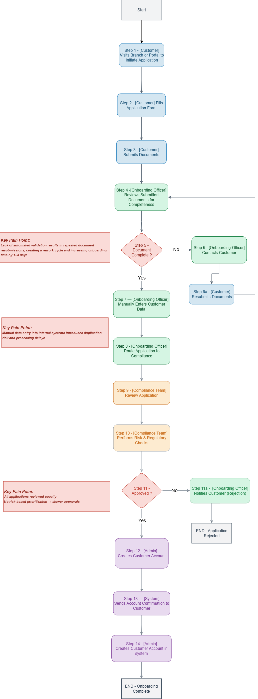
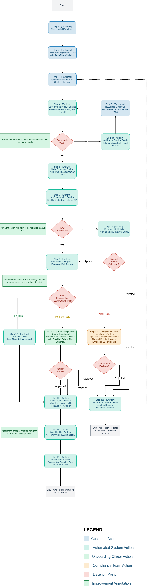
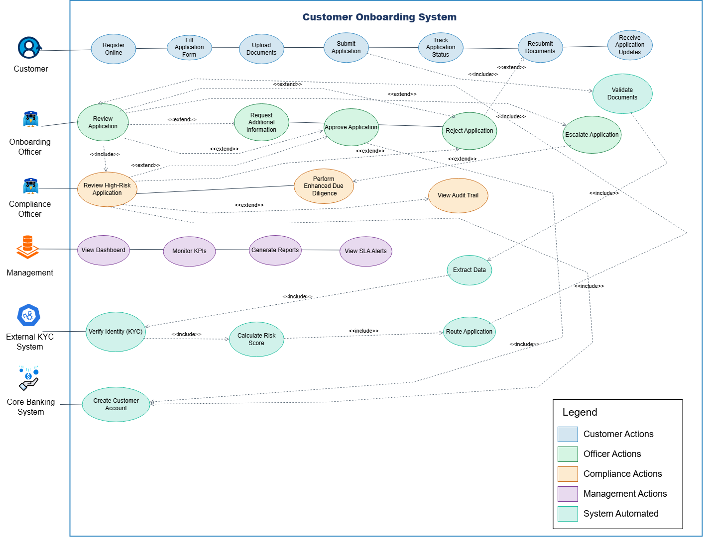
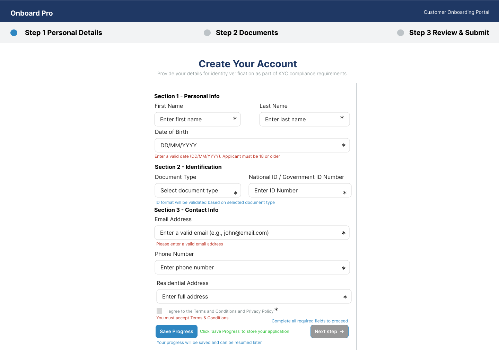
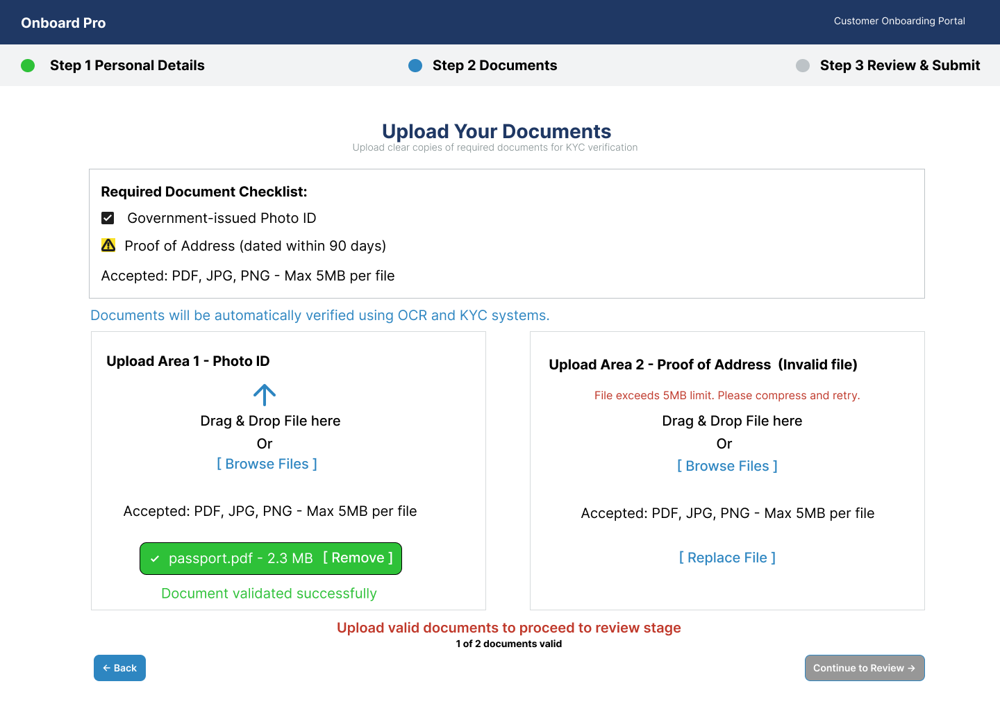
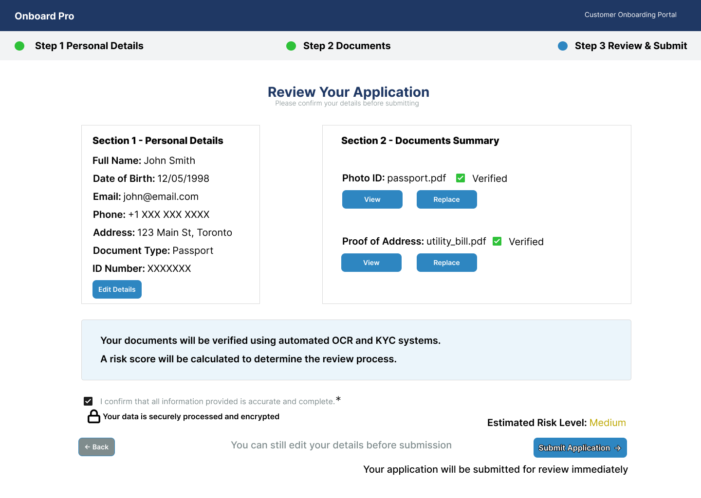
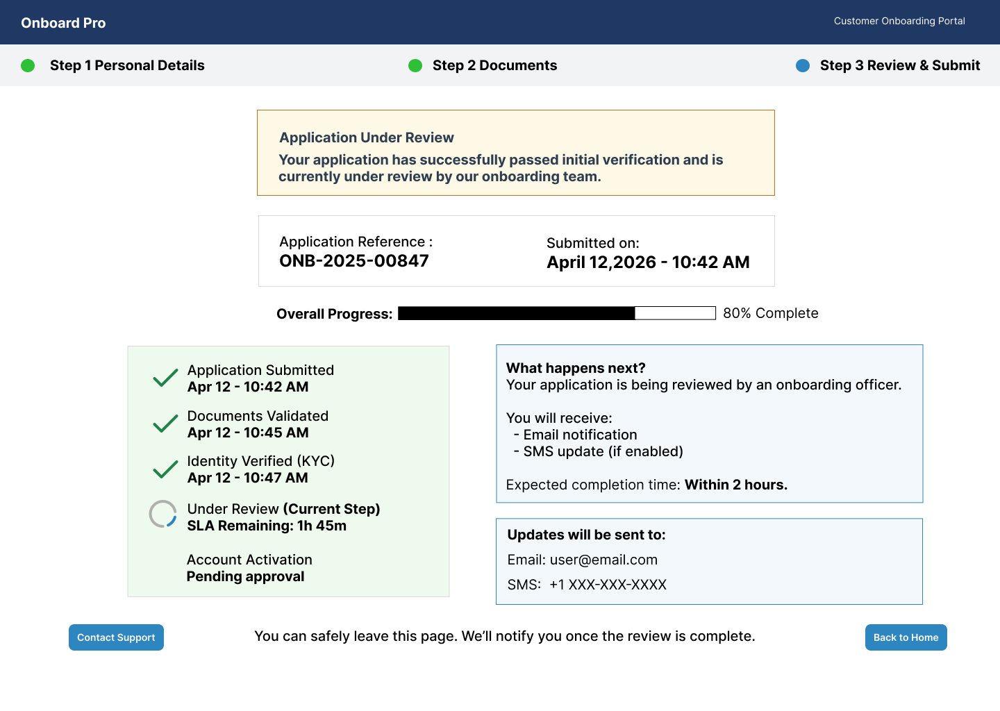
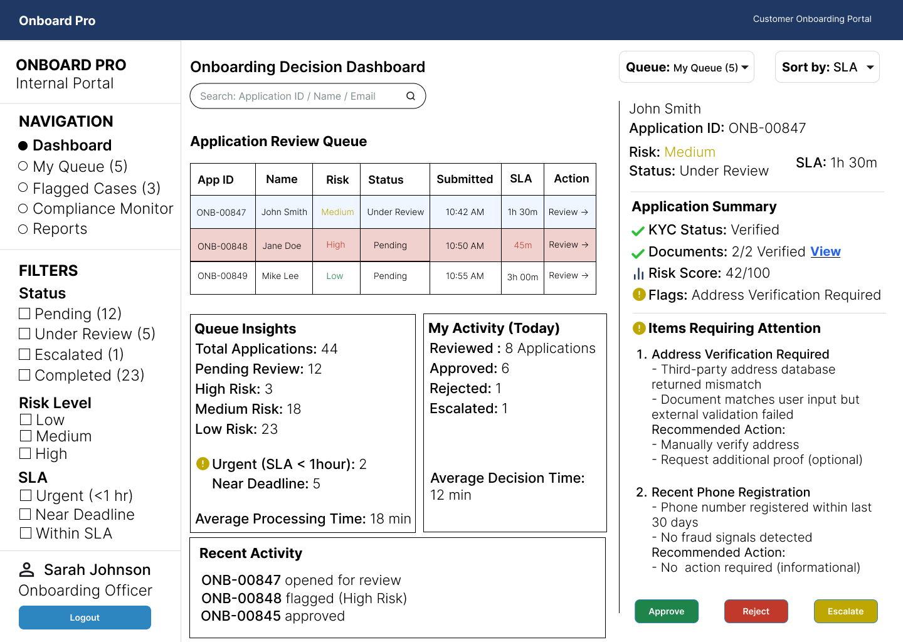
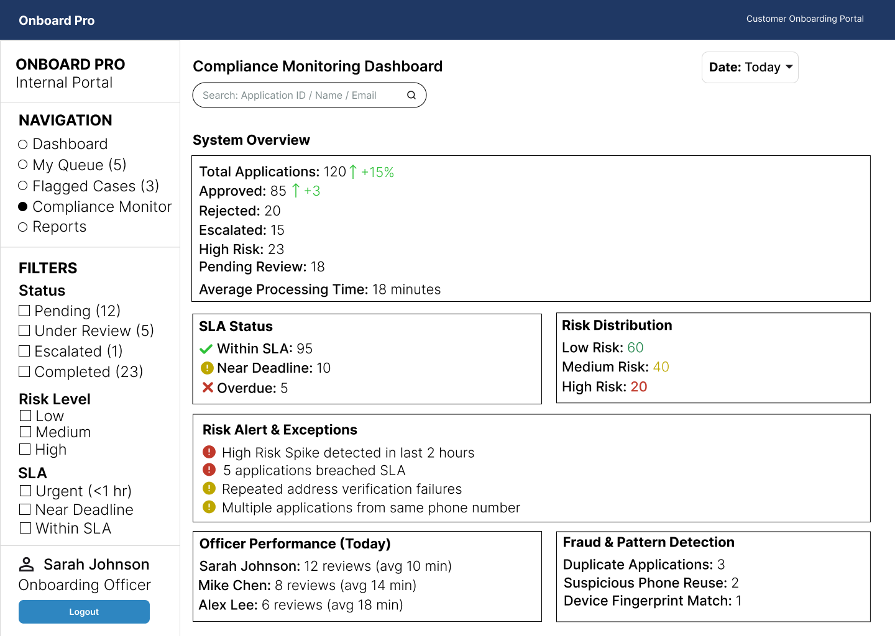

# End-to-End Digital Customer Onboarding System  
Risk-Based Decisioning | Process Automation | Real-Time Analytics

---

## Project Overview
This project designs a digital customer onboarding system that replaces a manual, branch-dependent process with an automated, risk-driven workflow.

- Reduced onboarding time from 5–7 days to under 24 hours  
- Reduced manual effort by 60–70%  
- Improved accuracy and customer experience through automation  

---

## Quick Highlights (Start Here)

- Reduced onboarding time from **5–7 days to under 24 hours**
- Designed a **risk-based decision engine (0–100 scoring)**
- Automated **document validation, KYC verification, and routing**
- Built **real-time dashboards for SLA and performance tracking**

Recommended sections in the report:
- Page 9–12: TO-BE Process Design  
- Page 13–17: Risk Scoring Model  
- Page 41–50: User Stories and Use Cases  

---

## System Architecture and Process Flow

### AS-IS Process (Current State)

### TO-BE Process (Optimized Solution)

### Use Case Diagram

---

## UI Screens

### Customer Portal

### Document Upload

### Review and Confirm

### Application Status Tracking

### Onboarding Officer Dashboard

### Compliance Dashboard

---

## Core Features

### Digital Onboarding
- Online registration with real-time validation  
- Guided document upload with checklist  
- Save and resume application  

### Automated Document Processing
- OCR-based data extraction  
- Format, size, and completeness validation  
- Immediate feedback for invalid submissions  

### Risk-Based Decision Engine
Score range: 0–100

Factors:
- Identity verification  
- Data consistency  
- Duplicate detection  
- External and behavioral signals  

| Risk Level | Score Range | Action |
|------------|------------|--------|
| Low        | 0–40       | Auto-approve |
| Medium     | 41–70      | Officer review |
| High       | 71–100     | Compliance escalation |

### Workflow Routing
- Auto-approval for low-risk applications  
- SLA-based review for medium-risk cases  
- Compliance escalation for high-risk cases  

### Notifications
- Email and SMS updates at each stage  
- Rejection reasons with resubmission links  
- Account confirmation alerts  

### Audit and Compliance
- Immutable audit logs  
- Full decision traceability  
- SLA breach alerts  

### Analytics and Monitoring
- Approval rate tracking  
- SLA compliance monitoring  
- Risk distribution insights  
- Processing time analysis  

---

## Documentation

- [Full Report](docs/Full_Report.pdf) – Complete end-to-end case study  

---

## Business Impact

- Onboarding time reduced from 5–7 days to under 24 hours  
- Customer drop-off reduced by approximately 30%  
- Manual workload reduced by 60–70%  
- SLA compliance improved to 95%+  

---

## Tools Used

- Figma  
- Draw.io  
- Documentation artifacts (BRD, FRD, user stories, use cases)  

---

## Note
This is a portfolio project demonstrating business analysis, system design, workflow automation, and process optimization skills.

---

## Author
Kamendrasingh Chahar
